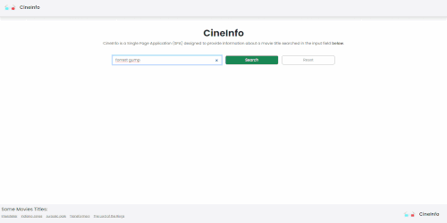

#  CineInfo


## Overview

<b>CineInfo</b> is an application that allows users to search for movies by their title. It fetches and presents essential details, including the poster image, rating, official title, and plot, utilizing the OMDb API to provide a comprehensive movie experience.

<div align="center">
  
</div>

## 🔨 Features

- Search for movie titles
- View detailed information about the searched movies

## ✔️ Technologies Used

### Main Technologies

- `Angular 18`
- `TypeScript`
- `Bootstrap 5`
- `SCSS`
- `OMDb API`

### Testing Tools

- `jasmine`
- `karma`

## 🛠️ Getting Started

To get a local copy of the project up and running, follow these steps:

1. Clone the repository:

   ```bash
   git clone https://github.com/Vini0100/cineinfo.git
   ```

2. Install dependencies:

   ```bash
   npm install
   ```

3. Start the development server:

   ```bash
   ng serve
   ```

4. Open your browser and visit http://localhost:4200 to view the application.

## 🧪 Testing

To run the tests for the project, use the following commands:

- Run tests:

  ```bash
  ng test
  ```

# Author 👨‍💻

| [<br><sub>Vinícius Andrade Gonzato</sub>](https://github.com/Vini0100) |
| :--------------------------------------------------------------------------------------------------------------------------------------------------------------: |
